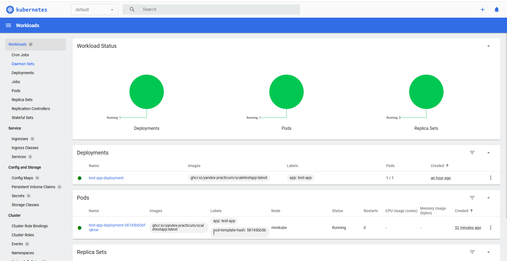
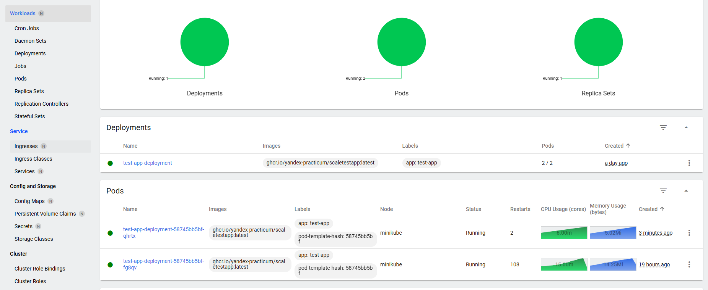
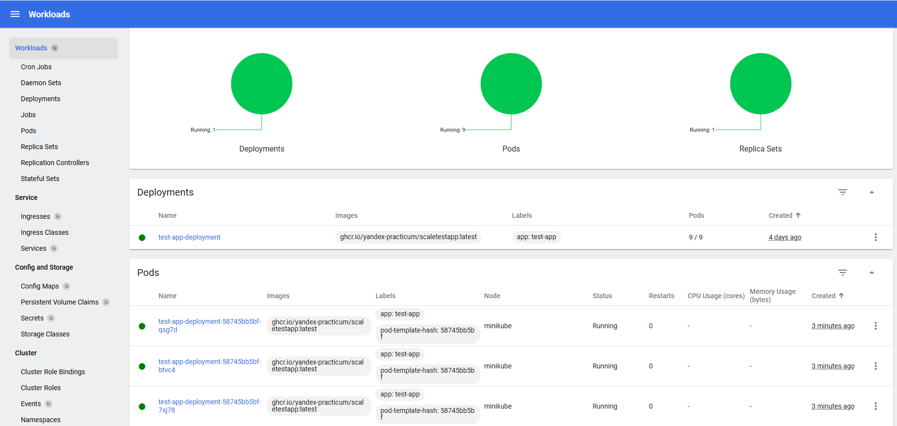

# Задание 1. Проектирование технологической архитектуры

Согласно заданию, целевые показатели доступности таковы:

- **Режим работы**: 24/7 (при этом сервис должен обслуживать клиентов из всех часовых поясов)
- **Доступность**: 99,9%
- **RTO** (целевое время восстановления):45 мин
- **RPO** (целевая точка восстановления, максимально допустимая потеря данных): 15 мин

Доступность 99,9 означает, что за год допустимо суммарное время простоя не более 8,76 часов (т.е. не более 11 случаев
восстановления).

```markdown
Дополнительно к этому нужно обеспечить одинаковое время загрузки страниц для пользователей из разных регионов. Оно не
должно зависеть от географического местоположения пользователя.
```

Выбрана фейловер-стратегия Active-Active с георезервированием. Это решение диктуется необходимостью обеспечить
одинаковое время загрузки при запросах из разных регионов.

При этом принято решение развертывать два независимых кластера Kubernetes с тем, чтобы за счет использования GSLB
обеспечить направление запроса пользователя на географически ближайший (из доступных) сервер. Это решение позволит в
перспективе при необходимости ввести дополнительные экземпляры сервисов для улучшения надежности и/или улучшения времени
отклика.

Диаграмма
решения: [InureTech_технологическая архитектура_to-be.xml](Task1/InureTech_%D1%82%D0%B5%D1%85%D0%BD%D0%BE%D0%BB%D0%BE%D0%B3%D0%B8%D1%87%D0%B5%D1%81%D0%BA%D0%B0%D1%8F%20%D0%B0%D1%80%D1%85%D0%B8%D1%82%D0%B5%D0%BA%D1%82%D1%83%D1%80%D0%B0_to-be.xml)


# Задание 2. Динамическое масштабирование контейнеров

## Часть 1. Масштабирование по метрикам расхода памяти

Загрузка приложения для тестирования:

```shell
docker pull ghcr.io/yandex-practicum/scaletestapp
```

Активация metrics-service:

```shell
kubectl apply -f https://github.com/kubernetes-sigs/metrics-server/releases/latest/download/components.yaml
minikube addons enable metrics-server
```

Манифест развертывания:

```shell
kubectl apply -f Task2/deployment.yaml
```

Манифест сервиса:

```shell
kubectl apply -f Task2/service.yaml
```

Получить адрес для проверки развертывания:

```shell
minikube service test-app-service --url
```

Манифест HPA:

```shell
kubectl apply -f Task2/hpa.yaml
```

Скриншоты дашборда Minikube





Логи HPA Minikube:

```
Events:
  Type     Reason                        Age                    From                       Message
  ----     ------                        ----                   ----                       -------
  Normal   SuccessfulRescale             5m24s (x5 over 23h)    horizontal-pod-autoscaler  New size: 2; reason: memory resource utilization (percentage of request) above target
  Warning  FailedGetResourceMetric       112s (x1800 over 23h)  horizontal-pod-autoscaler  failed to get memory utilization: unable to get metrics for resource memory: no metrics returned from resource metrics API
  Warning  FailedComputeMetricsReplicas  112s (x1800 over 23h)  horizontal-pod-autoscaler  invalid metrics (1 invalid out of 1), first error is: failed to get memory resource metric value: failed to get memory utilization: unable to get metrics for resource memory: no metrics returned from resource metrics API
```

На текущих настройках удалось добиться только масштабирования до двух подов, при этом приложение вело себя нестабильно.

## Часть 2. Масштабирование по метрике числа запросов

Установка Prometheus в Minikube

```shell
helm repo add prometheus-community https://prometheus-community.github.io/helm-charts
helm install prometheus prometheus-community/kube-prometheus-stack -n monitoring --create-namespace
```

Проверка установки и старта мониторинга в Minikube

```shell
kubectl get pods -n monitoring
```

Проброс порта для интерфейса Prometheus

```shell
kubectl port-forward -n monitoring prometheus-prometheus-kube-prometheus-prometheus-0 9090
```

Приложение уже обслуживает эндпойнт `/metrics`. Необходимо только настроить передачу в Prometheus.

Настройка Prometheus adapter:

```shell
helm install prometheus-adapter prometheus-community/prometheus-adapter --namespace monitoring --values Task2/adapter-values.yaml
```

или (обновление)
```shell
helm upgrade prometheus-adapter prometheus-community/prometheus-adapter -f "Task2/adapter-values.yaml"  -n monitoring --reset-values  
```

или (полное обновление)

```shell
helm upgrade prometheus-adapter prometheus-community/prometheus-adapter -n monitoring --values Task2/adapter-values.yaml --install --reset-values  
```

Установка сервис-монитора

```shell
kubectl apply -f Task2/service-monitor.yaml
```

Применение нового правила HPA

```shell
kubectl apply -f Task2/hpa-new.yaml
```

Скриншоты дашборда Minikube:



Логи HPA Minikube:
```
Normal   SuccessfulRescale        6m10s                  horizontal-pod-autoscaler  New size: 4; reason: pods metric test_app_rps above target
Normal   SuccessfulRescale        5m55s                  horizontal-pod-autoscaler  New size: 8; reason: pods metric test_app_rps above target
Normal   SuccessfulRescale        5m38s                  horizontal-pod-autoscaler  New size: 9; reason:
```

# Задание 3. Переход на Event-Driven архитектуру

Файл с результатами анализа проблем и
рисков: [проблемы и риски.md](Task3/%D0%BF%D1%80%D0%BE%D0%B1%D0%BB%D0%B5%D0%BC%D1%8B%20%D0%B8%20%D1%80%D0%B8%D1%81%D0%BA%D0%B8.md)

Диаграмма контейнеров решения:

[InsureTech_C4_сontainer-diagram.drawio.xml](Task3/InsureTech_C4_%D1%81ontainer-diagram.drawio.xml)


В применении паттерна Transactional Outbox нет необходимости, поскольку сервис `ins-product-aggregator` не хранит
данные.

# Задание 4. Проектирование продажи ОСАГО

```markdown
Бизнесу важно, чтобы на экране пользователя предложения от каждой страховой компании отображались сразу, как только от
неё пришёл ответ. Максимальное время ожидания решения от страховой компании — 60 секунд.

Все страховые компании предоставляют однотипные REST API с двумя эндпоинтами:

- создать заявку на ОСАГО,
- получить предложение по заявке.

Бизнес предполагает, что в пик нагрузки количество одновременных пользователей, создающих заявку на ОСАГО, может
достигать 2,5 тысячи человек.

Вы обсудили задачу с командой разработки и приняли такие решения:

- Сохранить подход, который использовался для получения данных о продуктах и тарифах из страховых компаний.
- Выделить отдельный сервис для взаимодействия со страховыми компаниями — osago-aggregator.

Функциональная обязанность этого сервиса — отправка заявок в страховые компании и дальнейший опрос решений по ним для
передачи результатов в core-app. Остальная функциональность, связанная с оформлением ОСАГО, остаётся на стороне бэкенда
в core-app.
```

Поскольку ранее было принято решение о переходе на асинхронное взаимодействие между `core-app` и
`ins-product-aggregator` (получение данных о продуктах и тарифах из страховых компаний), то аналогичным образом будет
организовано и взаимодействие `core-app` с `osago-aggregator`.

## Проработка решения

| Вопрос                                                                                                     | Решение и обоснование                                                                                                                                                                                                                                                                                                     |
|:-----------------------------------------------------------------------------------------------------------|:--------------------------------------------------------------------------------------------------------------------------------------------------------------------------------------------------------------------------------------------------------------------------------------------------------------------------|
| Требуется ли сервису `osago-aggregator` своё хранилище данных?                                             | Нет. В хранилище можно было бы хранить перечень начатых, но не завершенных опросов на случай падения, однако таймаут операции по ОСАГО низкий (60 сек), сервис не успеет перезапуститься и "подхватить" свои прежние опросы. В случае падения проще просить пользователя начать операцию заново.                          |
| Какой API сервис `osago-aggregator` предоставляет сервису `core-app`?                                      | 'Core-app' передает в очередь событие "Новая заявка на ОСАГО"                                                                                                                                                                                                                                                             |
| Каково средство интеграции между сервисами `core-app` и `osago-aggregator`?                                | Очередь сообщений (та же что при получении данных о продуктах и тарифах из страховых компаний), но для обмена по оформлению ОСАГО имеет смысл ввести отдельный топик                                                                                                                                                      |
| Каков API для веб-приложения в `core-app`?                                                                 | REST-эндпойнт для заявки на ОСАГО может быть введен заново или повторно использован имеющийся для других видов заявок на страховку. Должен добавиться механизм оповещения по инициативе `core-app`                                                                                                                        |
| Каково средство интеграции между веб-приложением и `core-app`?                                             | Так как предложения нужно отображать пользователю немедленно, желательно использование Server Side Events или Websockets (выбор сделать с учетом опыта команды разработки)                                                                                                                                                |
| Требуется ли где-то применение паттернов отказоустойчивости (Rate Limiting,Circuit Breaker,Retry,Timeout)? | Использование Rate Limiting желательно на входе в `core-app`, так как это критическая система, ее стоит защитить от чрезмерной активности пользователей. На выходе `osago-aggregator` желателен Cirquit Breaker (чтобы случайно не опрокинуть партнерскую систему насмерть). Timeout и Retry, судя по всему, неприменимы. |
| Сервисы развернуты в нескольких экземплярах. Зависит ли ваше решение от этого?                             | Асинхронный характер решения позволяет не зависеть от числа экземпляров сервисов                                                                                                                                                                                                                                          |

## Диаграмма компонент для выработанного решения

[InsureTech_C4_сontainer-diagram.drawio.xml](Task4/InsureTech_C4_%D1%81ontainer-diagram.drawio.xml)


# Задание 5. Проектирование GraphQL API

Файл GraphQL-схемы: [schema.graphql](Task5/schema.graphql)

# Задание 6. Настройка Rate Limiting

Обновленный конфигурационный файл Nginx: [nginx](Task6/nginx)